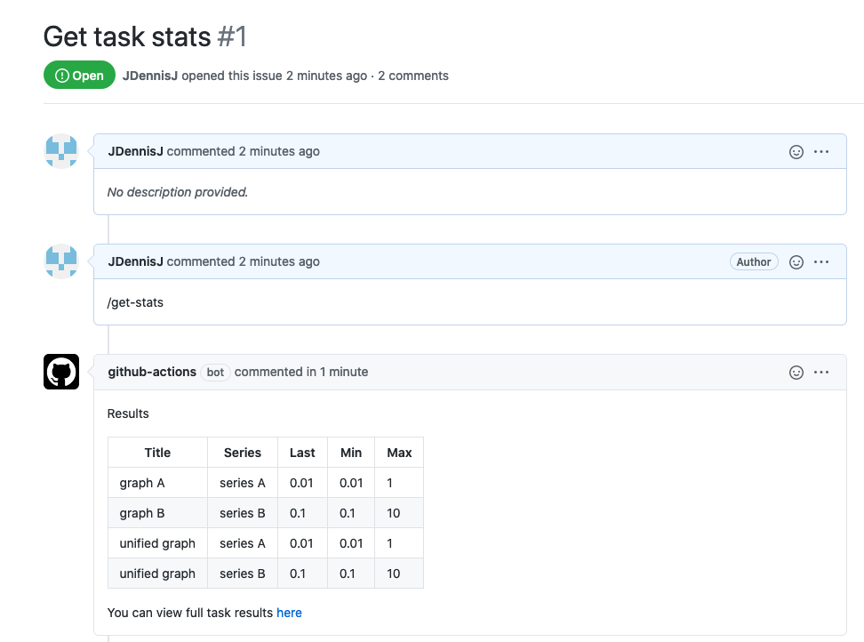

# GitHub Action For Retrieving Experiments Stats With ClearML


Get task results directly to your repo! 


This action helps to retrieve all ClearML [Tasks](https://clear.ml/docs/latest/docs/fundamentals/task)
 results and post them to Github discussion (issue or pull request). 

## Usage
### Workflow Example
This action adds an action to a workflow that will print the `TASK_ID` last metrics results to the current discussion. 

It works both in github issues and github pull requests comments.



```yaml
name: Get task stats
on: [issue_comment]

jobs:
  get-stats:
      if: contains(github.event.comment.body, '/get-stats')
      runs-on: ubuntu-latest
      steps:
        - name: Get task stats
          uses: allegroai/clearml-get-stats@master
          id: train
          with:
            CLEARML_API_ACCESS_KEY: ${{ secrets.ACCESS_KEY }}
            CLEARML_API_SECRET_KEY: ${{ secrets.SECRET_KEY }}
            CLEARML_API_HOST: ${{ secrets.CLEARML_API_HOST }}
            TASK_ID: "6f98c7d181b84327ae12e64537a97960"
          env:
            GITHUB_TOKEN: ${{ secrets.GITHUB_TOKEN }}
```

### Inputs

#### Mandatory Inputs
  1. `CLEARML_API_ACCESS_KEY`: Your ClearML api access key. You can find it in your clearml.conf file under api.credentials.access_key section, [read more](https://clear.ml/docs/latest/docs/). 
  2. `CLEARML_API_SECRET_KEY`: Your ClearML api secret key. You can find it in your clearml.conf file under api.credentials.secret_key section, [read more](https://clear.ml/docs/latest/docs/).
  3. `CLEARML_API_HOST`: The ClearML api server address. You can find it in your clearml.conf file under  api.api_server section, [read more](https://clear.ml/docs/latest/docs/).
  4. `TASK_ID`: Id of the task you would like to clone.
